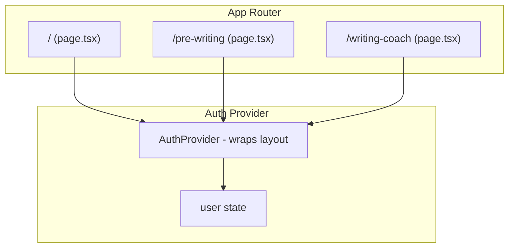

# Auth, Routing, and Pre-Writing Null-Safety Fixes

## 1. Remove Local Storage Migration (Supabase-Only Mode)

**Goal:** The app works exclusively with Supabase authentication. All user data (projects, sessions, ideas, misfits) comes from Supabase — no localStorage for data.

**Changes:**

- Remove `migrateAllLocalStorageData` import and all migration logic from [app/page.tsx](app/page.tsx) (lines 47, 289-312)
- Remove the `hasLocalStorageData` check and migration block from both `loadSessionAndProjects` and `onAuthStateChange`
- Optionally delete [lib/migrate-localStorage.ts](lib/migrate-localStorage.ts) or keep it unused (it can be removed in a later cleanup)
- Remove localStorage keys for legacy data: `writing-coach-projects-*`, `ideation-sessions`, `misfit-ideas` are no longer read
- **No localStorage for user data anywhere** — all reads/writes go to Supabase

---

## 2. Fix Logout After Reload

**Root cause analysis:** After reload, `handleLogout` may succeed but the UI does not update. Possible causes:

- `onAuthStateChange` may not fire `SIGNED_OUT` reliably in all Supabase versions
- React state updates in `handleLogout` may not trigger re-render if there is a stale closure
- The Supabase client may need explicit `scope: 'local'` to clear the current tab's session

**Diagnostic approach:** Add console logs to trace the flow:

```
[Logout] handleLogout called
[Logout] signOut result: { error }
[Logout] Auth state change: { event }
```

**Elegant solution:**

1. Add `console.log` statements in `handleLogout` and `onAuthStateChange` for diagnosis
2. Ensure `handleLogout` performs **synchronous** state clears before/after `signOut()` so the UI updates immediately regardless of when the auth callback fires
3. As a robust fallback: after `signOut()`, call `window.location.href = '/'` or `router.push('/')` and `router.refresh()` to force a clean client-side navigation. This guarantees the auth screen is shown even if React state or the auth listener misbehaves
4. Consider `signOut({ scope: 'local' })` if `scope: 'global'` (default) causes issues with session persistence across tabs

**Files:** [app/page.tsx](app/page.tsx) - `handleLogout` (line 633), `onAuthStateChange` (line 268)

---

## 3. URL-Based Routing (Separate Pages)

**Current:** Single page at `/` with state-driven views (`currentState`, `selectedTool`). Reload always lands on `/`.

**Target:** Three distinct routes that persist on refresh:

- `/` — Home (tool select)
- `/pre-writing` — Pre-Writing Ideation
- `/writing-coach` — Writing Coach

**Architecture:**



**Implementation:**

1. **Create `AuthProvider`** — New file `components/auth-provider.tsx`:

   - Fetches session via `supabase.auth.getSession()` on mount
   - Subscribes to `onAuthStateChange`
   - Provides `{ user, loading }` via React Context
   - No localStorage migration logic

2. **Wrap app in AuthProvider** — Update [app/layout.tsx](app/layout.tsx) to wrap `{children}` with `AuthProvider`

3. **Create route structure:**

   - [app/page.tsx](app/page.tsx) — Slim down to **Home / tool select only** (auth gate, two cards linking to `/pre-writing` and `/writing-coach`)
   - `app/pre-writing/page.tsx` — Renders `PreWritingIdeation` with `user` from context, `onBack` navigates to `/`, `onLogout` calls signOut + redirect to `/`
   - `app/writing-coach/page.tsx` — Contains the Writing Coach dashboard/setup/working flow (extracted from current `page.tsx`)

4. **Extract Writing Coach content** — Move the dashboard, setup, working, evaluating, completed views from [app/page.tsx](app/page.tsx) into a new `WritingCoachApp` component (or inline in `app/writing-coach/page.tsx`)

5. **Use Next.js navigation** — Replace `setCurrentState` / `setSelectedTool` with `router.push('/')`, `router.push('/pre-writing')`, `router.push('/writing-coach')`

6. **Remove all navigation state localStorage** — `app-navigation-state`, `app-selected-tool`, and `ideation-current-view` are no longer used. URL is the single source of truth.

7. **Pre-Writing sub-views via URL params** — Use `useSearchParams()` for sub-views within `/pre-writing`:

| URL | View |

|-----|------|

| `/pre-writing` or `?view=dashboard` | Dashboard (session list) |

| `/pre-writing?view=setup` | New session setup |

| `/pre-writing?view=ideate&session=<id>` | Ideate |

| `/pre-writing?view=compare&session=<id>` | Comparative judgment |

| `/pre-writing?view=ranked&session=<id>` | Ranked results |

| `/pre-writing?view=review&session=<id>` | Review ideas |

| `/pre-writing?view=misfits` | Island of Misfit Ideas |

   - Read `view` and `session` from `useSearchParams()`
   - Update URL with `router.replace()` when navigating (e.g. clicking a session, switching views)
   - Session-dependent views (`ideate`, `compare`, `ranked`, `review`) require both `view` and `session`; if `session` is missing, redirect to dashboard

---

## 4. Fix `Cannot read properties of null (reading 'ideas')`

**Root cause:** In [components/pre-writing-ideation.tsx](components/pre-writing-ideation.tsx), `currentView` was restored from `localStorage` (`ideation-current-view`). After reload:

- User was in "ideate", "compare", "ranked", or "review"
- On reload, `currentView` is "ideate" (or similar) but `session` is `null` (fresh mount)
- The code at lines 843-846, 1107-1110, 1275, 1308 accesses `session.ideas` without checking `session`

With URL params, `view` and `session` come from the URL. If `view=ideate` but `session` is missing or invalid, we redirect to dashboard — preventing the null access.

**Fix:**

With URL params:

- When `view` is ideate/compare/ranked/review, require `session` in the URL
- If `session` param is missing or the session ID is not found in `allSessions`, `router.replace('/pre-writing')` to go to dashboard
- Load the session from `allSessions` by ID (from URL); show loading state while `allSessions` is being fetched from Supabase
- This naturally prevents `session.ideas` null access: we only render session-dependent views when we have a valid session

**Additional safety:** In the dashboard's `allSessions.map(s => ...)`, use `(s.ideas ?? []).length` at line 719 as a defensive measure.

---

## 5. Summary of File Changes

| File | Action |

|------|--------|

| [app/page.tsx](app/page.tsx) | Simplify to Home only; remove migration; fix logout; add console logs |

| [app/pre-writing/page.tsx](app/pre-writing/page.tsx) | **Create** — PreWritingIdeation page with auth from context |

| [app/writing-coach/page.tsx](app/writing-coach/page.tsx) | **Create** — Writing Coach page (extract from page.tsx) |

| [app/layout.tsx](app/layout.tsx) | Wrap children with AuthProvider |

| [components/auth-provider.tsx](components/auth-provider.tsx) | **Create** — Auth context, no migration |

| [components/pre-writing-ideation.tsx](components/pre-writing-ideation.tsx) | Replace `currentView` localStorage with URL params (`view`, `session`); add session null-guard; `s.ideas ?? []` |

| [lib/migrate-localStorage.ts](lib/migrate-localStorage.ts) | Remove usage (optionally delete file) |

---

## 6. Testing Checklist

- [ ] Logout works from home, pre-writing, and writing-coach after a fresh load
- [ ] Logout works after page reload
- [ ] `/`, `/pre-writing`, `/writing-coach` load correctly and refresh keeps you on the same URL
- [ ] Pre-writing sub-views (e.g. `/pre-writing?view=ideate&session=xxx`) persist on refresh
- [ ] Navigating from home to pre-writing (or writing-coach) and reloading does not crash
- [ ] No "ideas" null error when opening Pre-Writing Ideation after reload
- [ ] Auth gate redirects unauthenticated users to login on protected routes
- [ ] No localStorage used for user data or navigation state (only Supabase + URL)